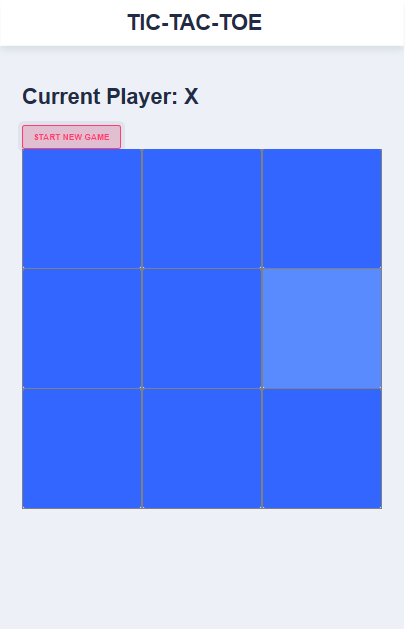
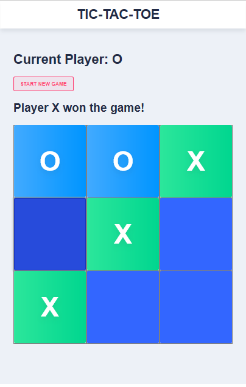

# Jogo-da-Velha

App made unsing AngularJS version 9

This is a quick project that was meant only for practice using the framework. My goal here is to challenge myself with something i have never done and to start creating new projects. This is my first time using Angular, or any framework so to speak, so i will take any suggestion to heart and improve myself with it.

Now for the project itself, it is a basic tic tac toe game that can be played by two people only, (no A.I) basically you have the main game, the option to start a new game, and you can even download it in your cellphone or desktop since it is a pwa app.

This is what the app looks like:

I uploaded this app to firebase so anyone can use it any time. You can acess it using this link:https://tictac-f10c2.firebaseapp.com/

## Intallation

If you want to intall this app on your phone, open the web page of the app, next click in "settings" and "add to home page", and that should be it, you can now acess this app anytime via your home page.
